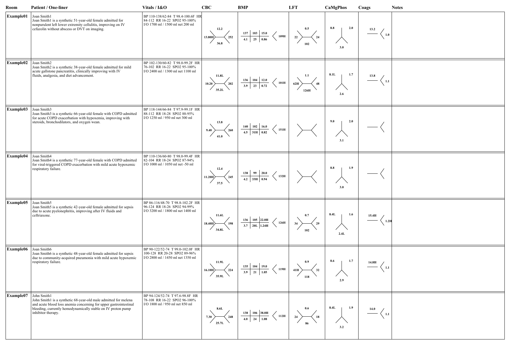

# Rounding Sheet

Generate a compact PDF rounding sheet with fishbone lab diagrams from inpatient progress-note text files.

The current usable workflow is [roundingsheet/make_rounding_sheet_from_text.py](roundingsheet/make_rounding_sheet_from_text.py). It reads room number, patient name, vitals, I/O, labs, and the one-liner directly from note text rather than from file names.

## Install

From Anaconda Prompt or a terminal:

```powershell
cd C:\GitHub\roundingsheet
conda create -n roundingsheet python=3.12 -y
conda activate roundingsheet
pip install -r requirements.txt
```

If the conda environment already exists:

```powershell
cd C:\GitHub\roundingsheet
conda activate roundingsheet
pip install -r requirements.txt
```

## Method 1: Text Notes

Activate the environment, then pass the folder containing progress-note `.txt` files:

```powershell
cd C:\GitHub\roundingsheet
conda activate roundingsheet
python .\roundingsheet\make_rounding_sheet_from_text.py C:\GitHub\roundingsheet\sample_notes
```

By default, the PDF is written into the same folder as the input notes:

```text
C:\GitHub\roundingsheet\sample_notes\rounding_sheet.pdf
```

## Example Output

Screenshot of the first page of the sample rounding sheet:



## Layout Options

Choose 6 to 10 patients per page:

```powershell
python .\roundingsheet\make_rounding_sheet_from_text.py C:\GitHub\roundingsheet\sample_notes --patients-per-page 6
python .\roundingsheet\make_rounding_sheet_from_text.py C:\GitHub\roundingsheet\sample_notes --patients-per-page 10
```

Choose a font preset:

```powershell
python .\roundingsheet\make_rounding_sheet_from_text.py C:\GitHub\roundingsheet\sample_notes --font-size small
python .\roundingsheet\make_rounding_sheet_from_text.py C:\GitHub\roundingsheet\sample_notes --font-size large
```

Available font sizes are `extra-small`, `small`, `medium`, and `large`. The default is `medium`.

Options can be combined:

```powershell
python .\roundingsheet\make_rounding_sheet_from_text.py C:\GitHub\roundingsheet\sample_notes --patients-per-page 6 --font-size large
```

## Expected Note Format

Save one full progress note per patient as a `.txt` file. The script expects these text anchors:

- `Patient Name:` near the top of the note.
- `Today's Date:` near the top of the note. Lab results from this date are preferred.
- `Location:` or `Locations:` near the top of the note.
- `Vital Signs`, followed by `Ranges:` with min/max rows.
- `Intake/Output Summary`, followed by `Intake`, `Output`, and `Net` rows.
- `New Labs and imaging- reviewed by me`, followed by Epic result tables with `Collection Time:` and `Result Value`.
- `Assessment/Plan:` or `Assessment`, followed immediately by the one-line patient summary.

The script keeps the most recent value for each lab from the note date when same-day labs are present. If no lab rows match the note date, it falls back to the most recent lab collection date in the note. Abnormal flags such as `(H)` and `(L)` are compacted to values like `10.2L` or `18H`.

## Method 2: Hospital EMR Integration

A true Epic, Cerner, or other EMR integration should not require clinicians to copy progress notes manually. The intended hospital workflow is an IT-approved EMR button, print option, SlicerDicer-derived export, reporting extract, or embedded internal app that gathers structured tabular data and sends it to the shared PDF renderer in [roundingsheet/pdf_renderer.py](roundingsheet/pdf_renderer.py).

This repository does not include Epic/Cerner credentials, login automation, or private API calls. Hospital IT should choose the local integration path and map approved EMR data into the renderer's normalized patient-record structure for room, patient summary, vitals, I/O, labs, and notes.

See [docs/emr_integration.md](docs/emr_integration.md) for the proposed architecture and data contract for hospital IT review.

## Sample Notes

The top-level notes in [sample_notes](sample_notes) are entirely synthetic and intended for testing, demonstrations, and publication figures. Do not commit protected health information to this repository.
